# Practical Malware Analysis – Lab 1

## Lab 1-1

### Q1

>Upload the files to http://www.VirusTotal.com/ and view the reports. Does either file match any existing antivirus signatures?

- Lab01-01.dll

Yes. VirusTotal detected the file as malicious. At the time of analysis, 37 out of 68 antivirus engines identified the sample as malware

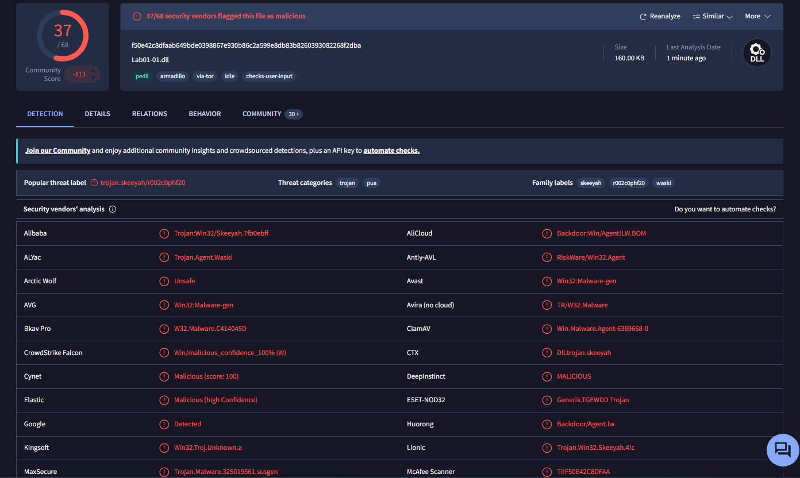

- Lab01-01.exe

Yes. VirusTotal detected the file as malicious. At the time of analysis, 54 out of 69 antivirus engines identified the sample as malware

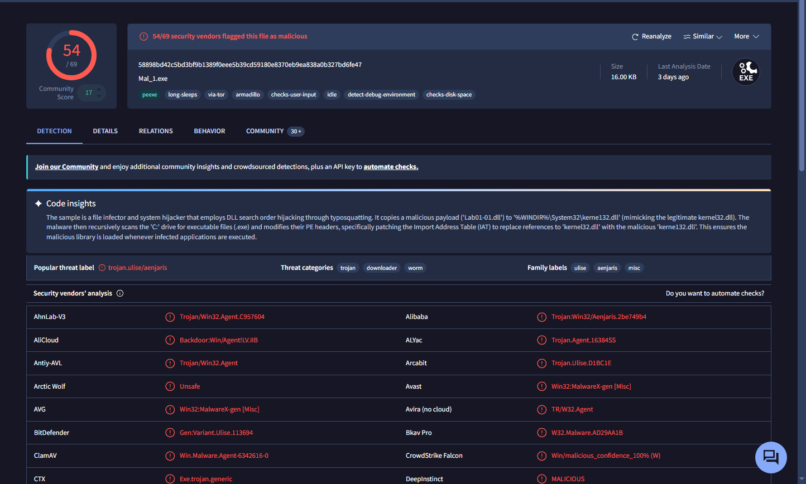

### Q2

>When were these files compiled?

- Lab01-01.dll

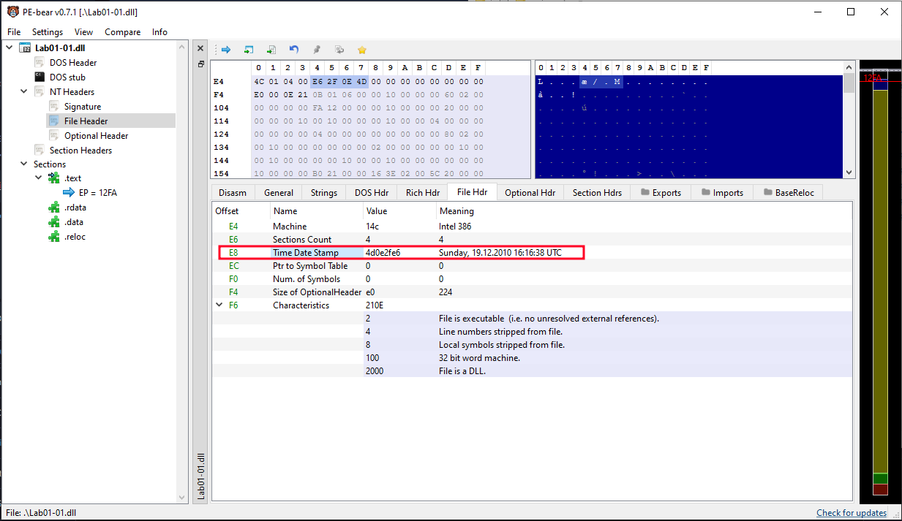

- Lab01-01.exe

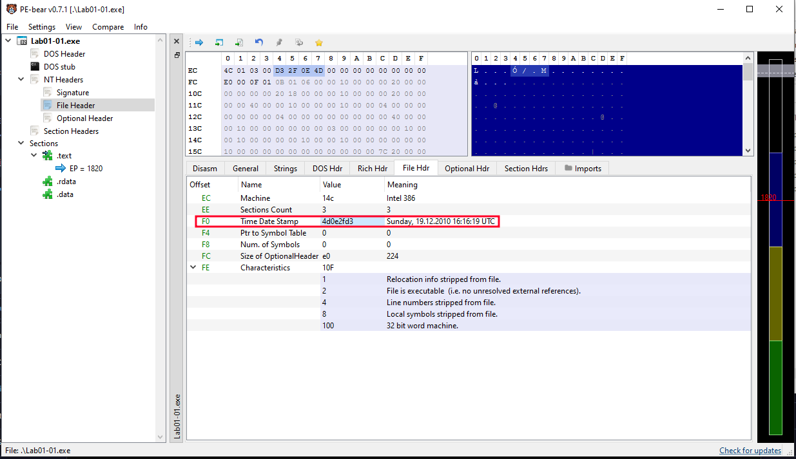

### Q3

> Are there any indications that either of these files is packed or obfuscated? If so, what are these indicators?

- Lab01-01.dll

The extracted strings indicate that the program is not packed.

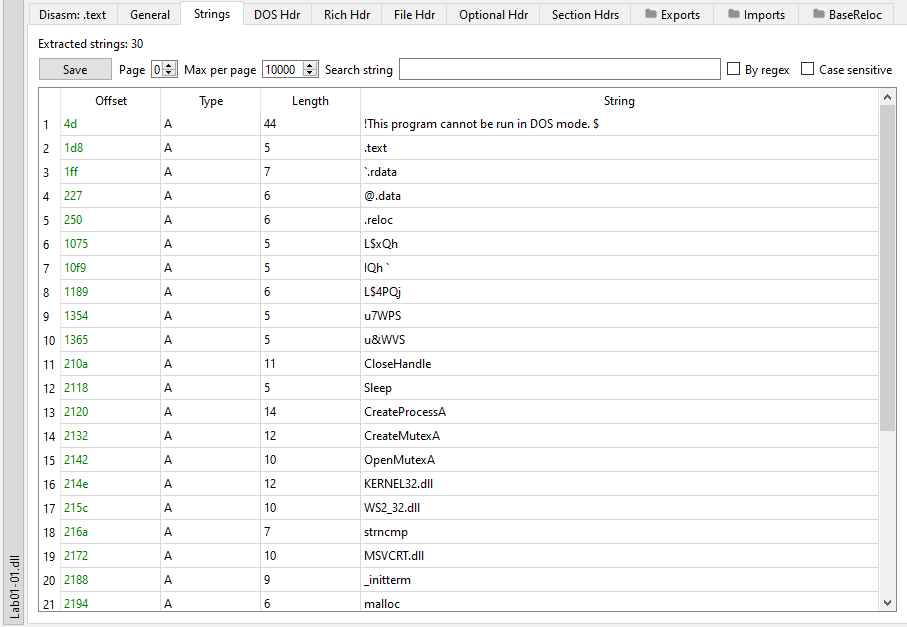

The imported functions also indicate that the program is not packed.

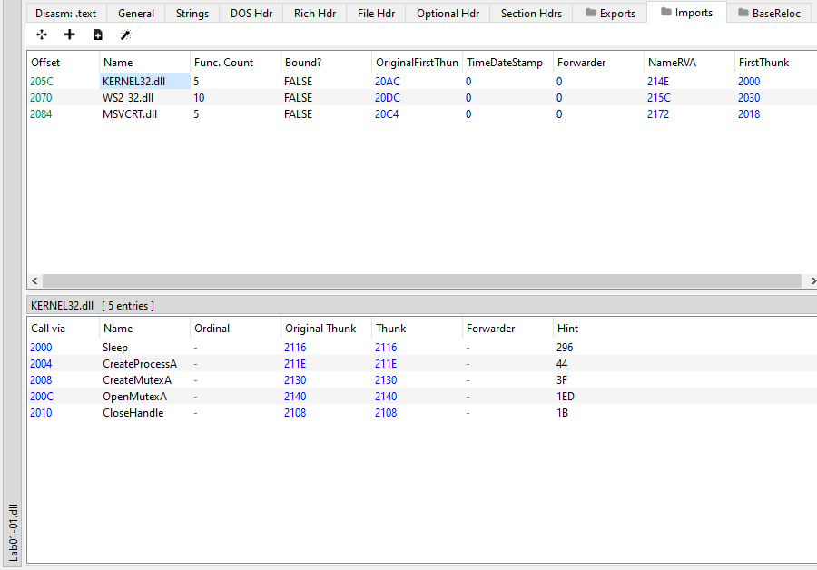

The difference between the Raw Size and the Virtual Size is also small, which indicates that the program is not packed.

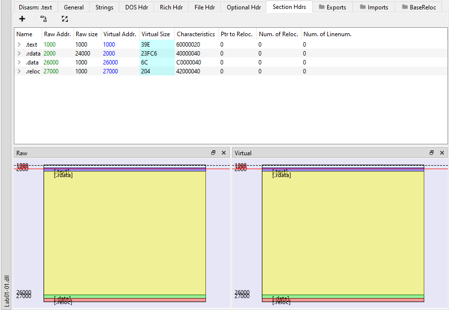

- Lab01-01.exe

As with the previous file, this file is also not packed.

### Q4

>Do any imports hint at what this malware does? If so, which imports are they?

- Lab01-01.dll

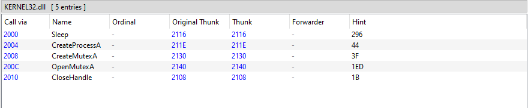

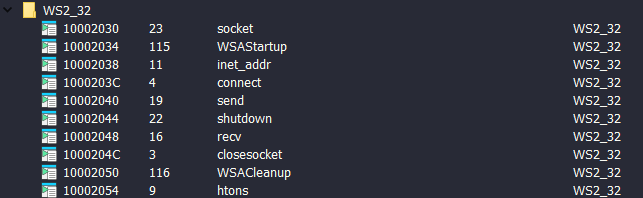

The imported functions suggest that the sample may establish a network connection to a remote host, send and receive data, create or manage additional processes, delay its execution using time APIs, and ensure that only one instance of itself is running using mutex APIs.
However, these are only assumptions based on the imported functions and require further analysis to confirm.

- Lab01-01.exe

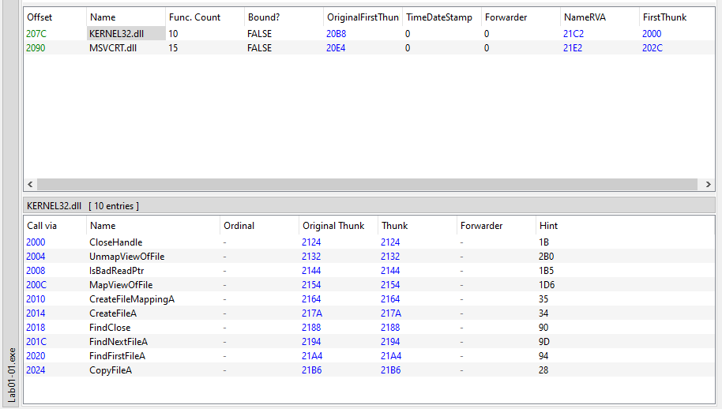

`CreateFileA`, `FindFirstFileA`, `FindNextFileA`, and `CopyFileA` suggest that the sample may create files, search for files, and copy files on the system.
### Q5

>Are there any other files or host-based indicators that you could look for on infected systems?

- Lab01-01.exe

The `CopyFileA` function may copy `Lab01-01.dll` to `C:\Windows\System32\kerne132.dll`. Therefore, executing the sample may infect the system. Additionally, there is an interesting string: `WARNING_THIS_WILL_DESTROY_YOUR_MACHINE`.

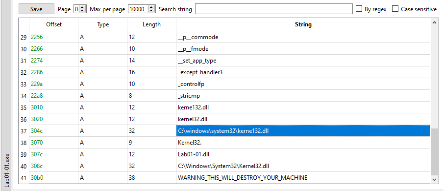
### Q6

>What network-based indicators could be used to find this malware on infected machines?

- Lab01-01.dll

In `Lab01-01.dll`, the IP address `127.26.152.13` may be used by the infected machine to communicate with a remote host by sending and receiving data.
Therefore, monitoring network traffic for connections to this IP address may help identify infected machines.

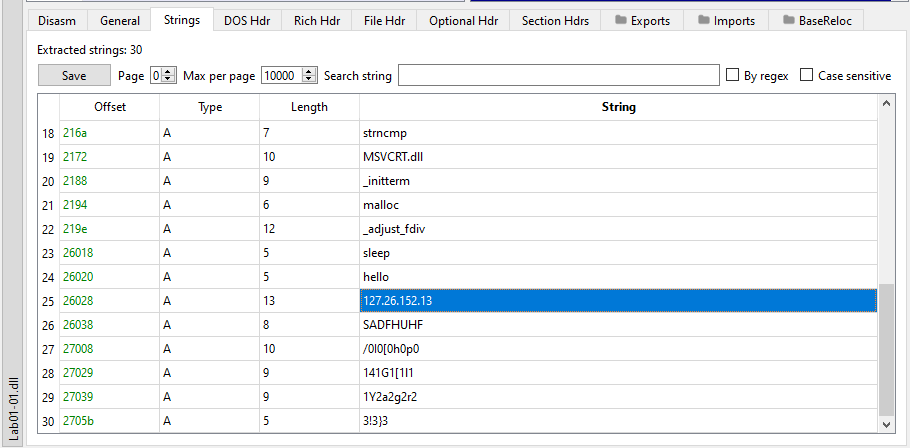
### Q7

>What would you guess is the purpose of these files?

`Lab01-01.exe` appears to install the malicious DLL by copying it to `C:\Windows\System32\kerne132.dll`. `Lab01-01.dll` likely contains the main malicious functionality, including communicating with a remote host.

## Lab 1-2

### Q1

>1.Upload the Lab01-02.exe file to http://www.VirusTotal.com/. Does it match any existing antivirus definitions?

Yes. VirusTotal detected the file as malicious. At the time of analysis, 55 out of 69 antivirus engines identified the sample as malware

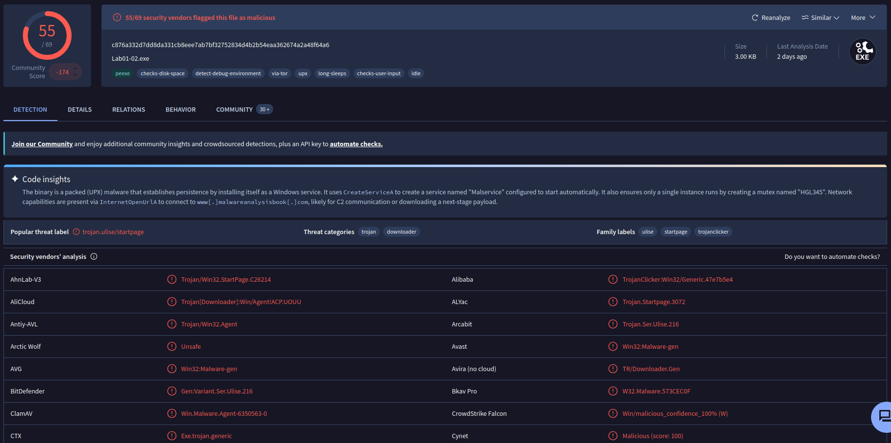

### Q2

>Are there any indications that this file is packed or obfuscated? If so, what are these indicators? If the file is packed, unpack it if possible.

From the strings, we can see that the file is packed with **UPX**.

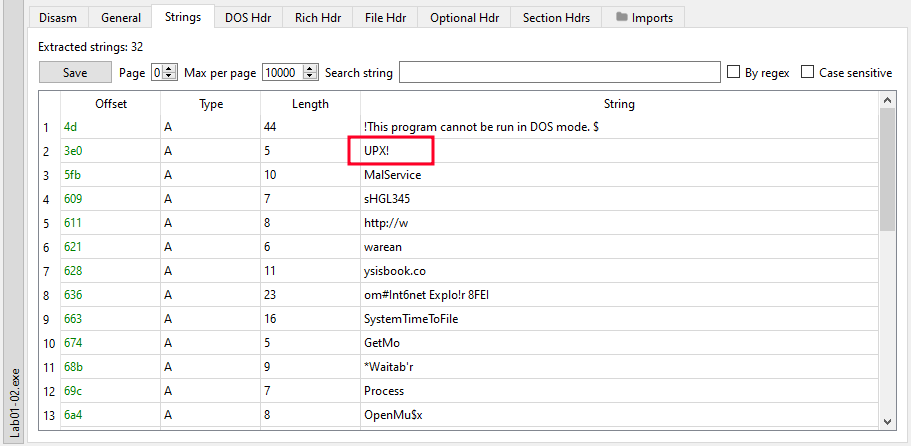

Or using Detect It Easy.

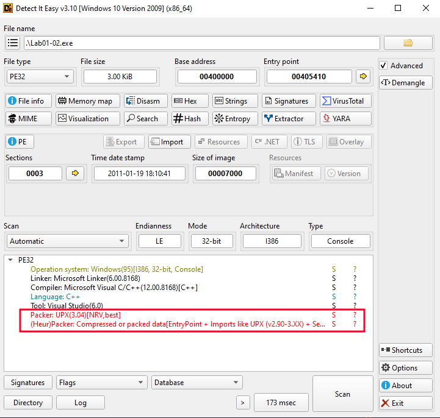

From the section headers, we can tell that the file is packed because there is a significant difference between the **Raw Size** and the **Virtual Size**. This indicates that the executable unpacks itself during execution.

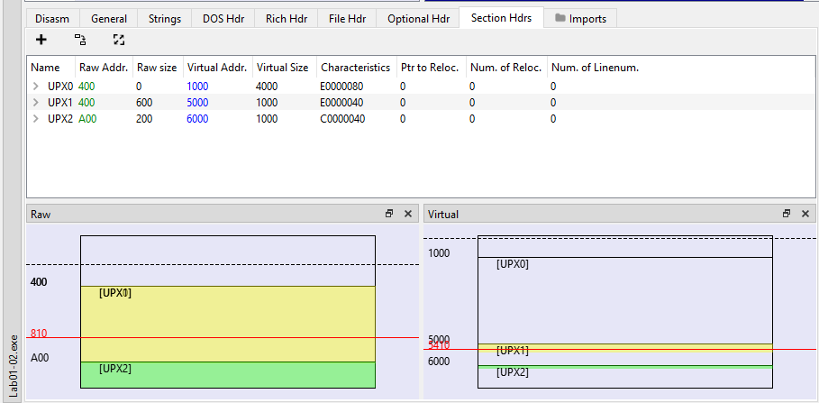

Another indicator is the small number of imported functions, along with the presence of **LoadLibraryA** and **GetProcAddress**, which are commonly used by packers to resolve imports at runtime.

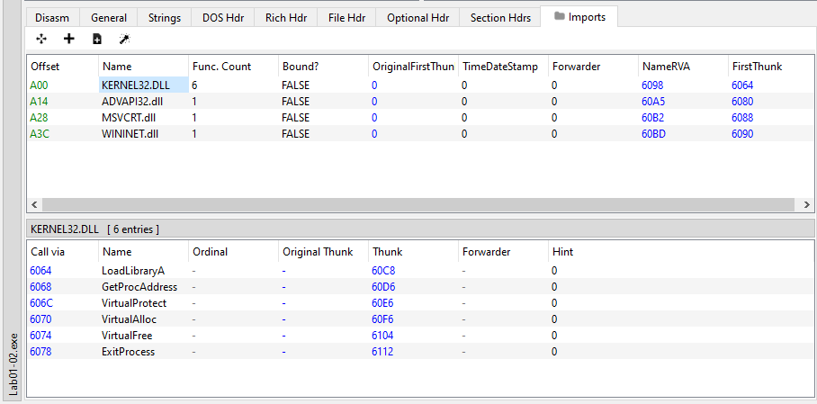

The executable can be unpacked using:

```
upx -d .\Lab01-02.exe -o .\Lab01-02-unpacked.exe
```

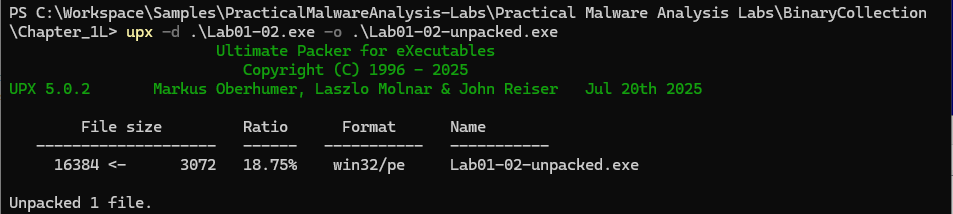

### Q3

>Do any imports hint at this program’s functionality? If so, which imports are they and what do they tell you?

`OpenMutexA` and `CreateMutexA` might be used by the program to ensure that only one instance of itself is running, preventing multiple instances.

`SystemTimeToFileTime`, `CreateWaitableTimerA`, `SetWaitableTimer`, and `WaitForSingleObject` might be used by the program to delay its execution for a period of time.

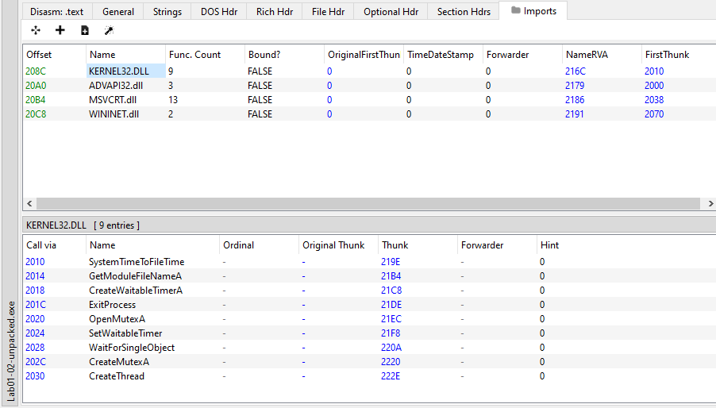

The program may use the following functions to create a service on the system. 

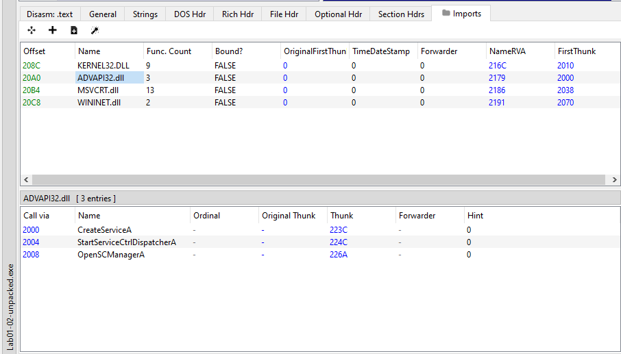

`WININET.dll` contains interesting functions such as `InternetOpenUrlA` and `InternetOpenA`. These functions may indicate the URLs that the program communicates with.

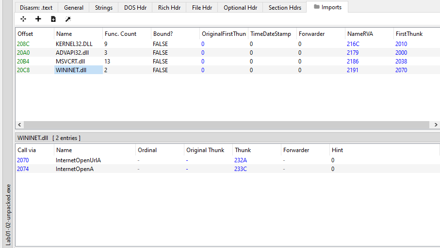

### Q4

>What host- or network-based indicators could be used to identify this malware on infected machines?

A network-based indicator is the URL `http://www.malwareanalysisbook.com`, which the program may connect to.

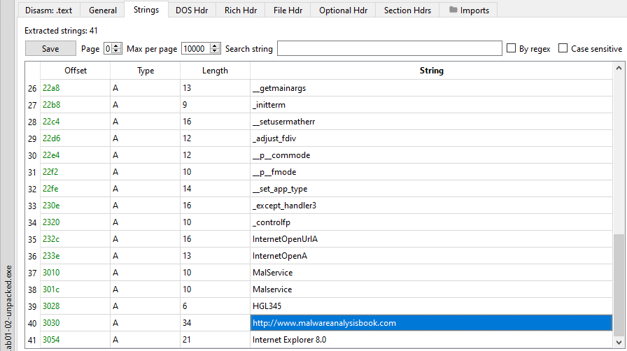

## Lab 1-3

### Q1
>Upload the Lab01-03.exe file to http://www.VirusTotal.com/. Does it match any existing antivirus definitions?

Yes. VirusTotal detected the file as malicious. At the time of analysis, 60 out of 7o antivirus engines identified the sample as malware

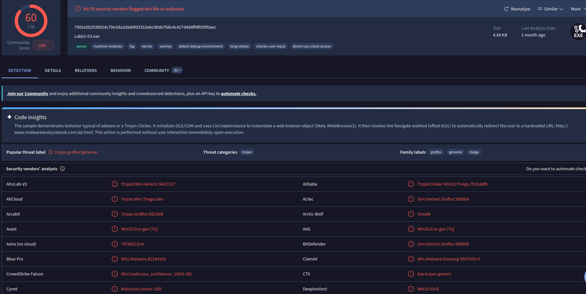
### Q2
>Are there any indications that this file is packed or obfuscated? If so, what are these indicators? If the file is packed, unpack it if possible.

The functions `LoadLibraryA` and `GetProcAddress` indicate that the file is packed.

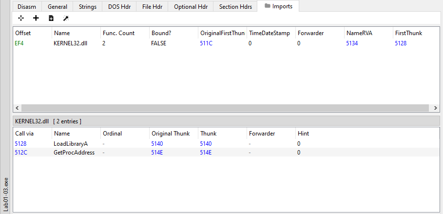

Detect It Easy tells us that the file is packed, but it does not identify the packer type.

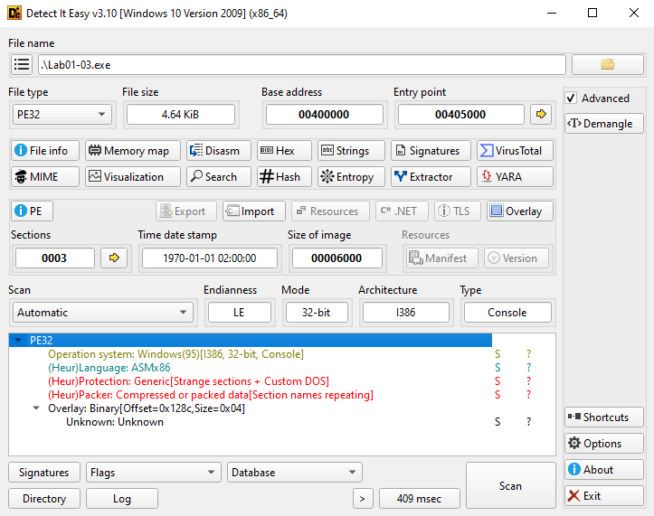

PEiD identifies the packer as **FSG 1.0**.

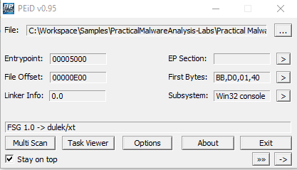

To unpack the file, we need to use a debugger.

### Q3

>Do any imports hint at this program’s functionality? If so, which imports are they and what do they tell you?

The program is still packed, so we cannot identify its functionality yet.
### Q4
>What host- or network-based indicators could be used to identify this malware on infected machines?

We also cannot identify its functionality because the program is still packed.

## Lab 1-4

### Q1

>Upload the Lab01-04.exe file to http://www.VirusTotal.com/. Does it match any existing antivirus definitions?

Yes. VirusTotal detected the file as malicious. At the time of analysis, 63 out of 7o antivirus engines identified the sample as malware

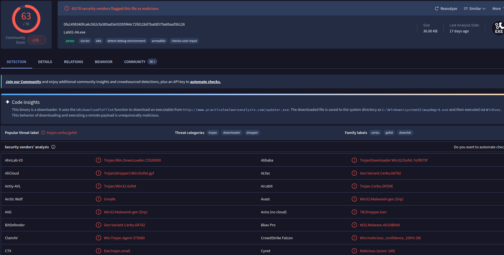
### Q2

>Are there any indications that this file is packed or obfuscated? If so, what are these indicators? If the file is packed, unpack it if possible.

The extracted strings indicate that the program is not packed.

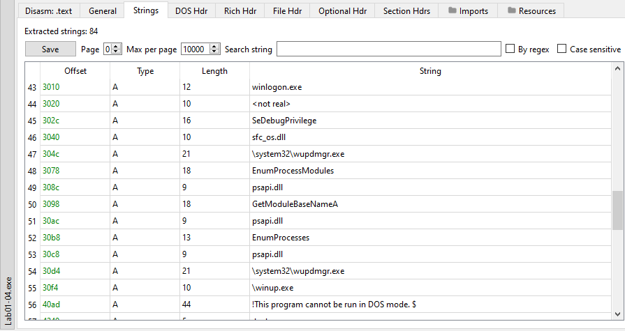

The imported functions also indicate that the program is not packed.

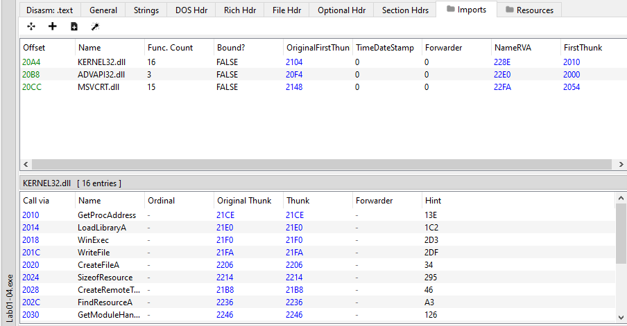

The difference between the Raw Size and the Virtual Size is also small, which indicates that the program is not packed.

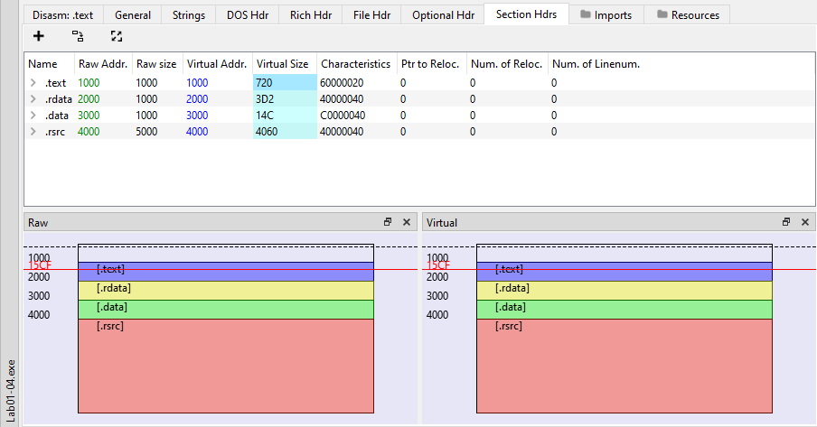
### Q3

>When was this program compiled?

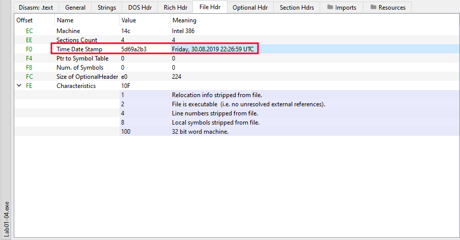
### Q4

>Do any imports hint at this program’s functionality? If so, which imports are they and what do they tell you?

The imports suggest that the program interacts with files and resources using functions such as `CreateFileA`, `WriteFile`, `FindResourceA`, `LoadResource`, and `SizeofResource`. It may also inject code into another process using `OpenProcess` and `CreateRemoteThread`.
### Q5

>What host- or network-based indicators could be used to identify this malware on infected machines?

If we look at strings, we can see exciting strings which is host and network indicators like, `\winup.exe`, `\system32\wupdmgrd.exe` and `http://www.practicalmalwareanalysis.com/updater.exe`

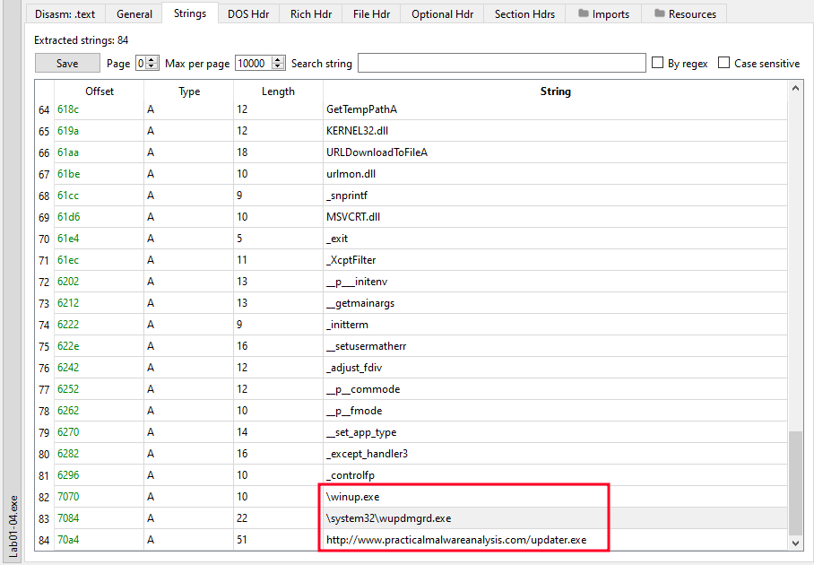
### Q6

>This file has one resource in the resource section. Use Resource Hacker to examine that resource, and then use it to extract the resource. What can you learn from the resource?

There is a PE file embedded in the resource section.

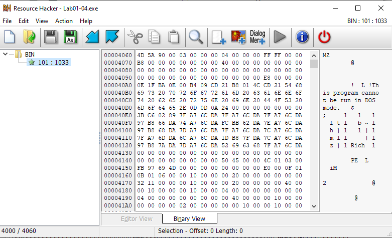

After extracting the file and starting basic static analysis, we can find interesting strings, such as:

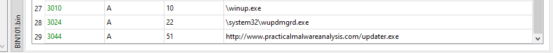

The imports also include `urlmon.dll`, which contains the interesting function `URLDownloadToFileA`.


# My notes for chapter 1

**Import by Ordinal**

The file `Lab01-01.dll` imports functions from `WS2_32.dll` by **ordinal** instead of by **name**, which can make static analysis more difficult.

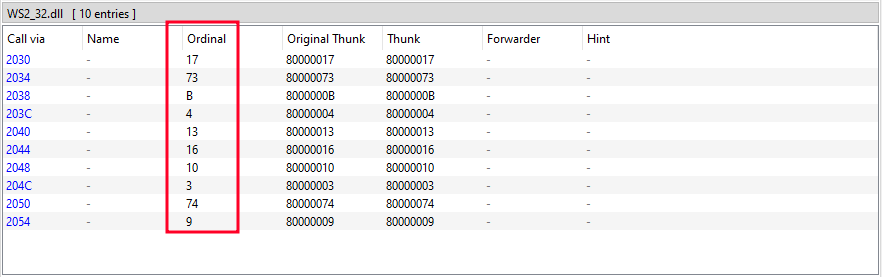

The `8` represents the `IMAGE_ORDINAL_FLAG` (MSB = 1), indicating that the Windows loader should import the function by its ordinal value rather than by its name. The remaining bits are simply used to store the ordinal value.

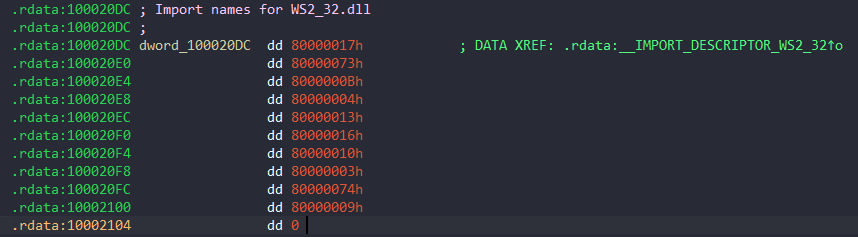

However, when the file is opened in IDA, the ordinal imports are automatically resolved to their corresponding function names:


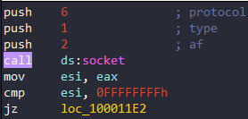


## Important APIs

- **CreateMutexA**: Creates or opens a named or unnamed mutex object.
- **OpenMutexW**: Opens an existing named mutex object.
- **GetModuleFileNameA**: Retrieves the fully qualified path for the file that contains the specified module. The module must have been loaded by the current process.
- **OpenSCManagerA**: Establishes a connection to the service control manager on the specified computer and opens the specified service control manager database.
- **CreateServiceA**: Creates a service object and adds it to the specified service control manager database.
- **StartServiceCtrlDispatcherA**: Connects the main thread of a service process to the service control manager, which causes the thread to be the service control dispatcher thread for the calling process.