## phase_1

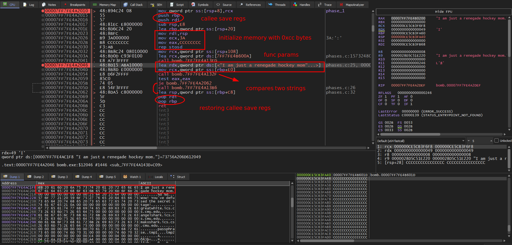

answer is: I am just a renegade hockey mom.
## phase_2

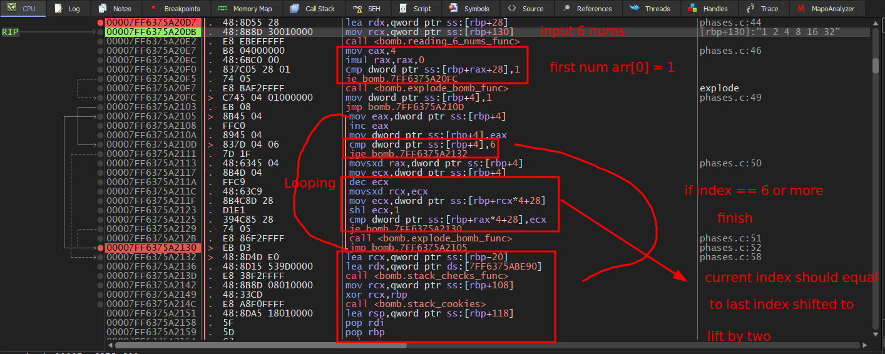

The program reads six integers.
- The first number must be 1
- Each subsequent number must be twice the previous one. The used equation: arr[i] = arr[i-1] * 2

## phase_3

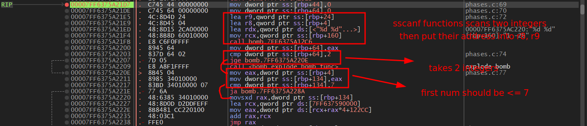

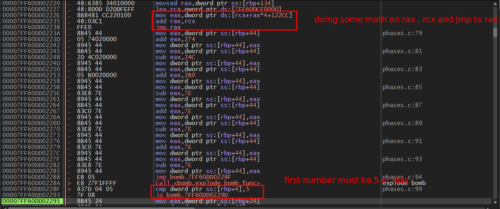


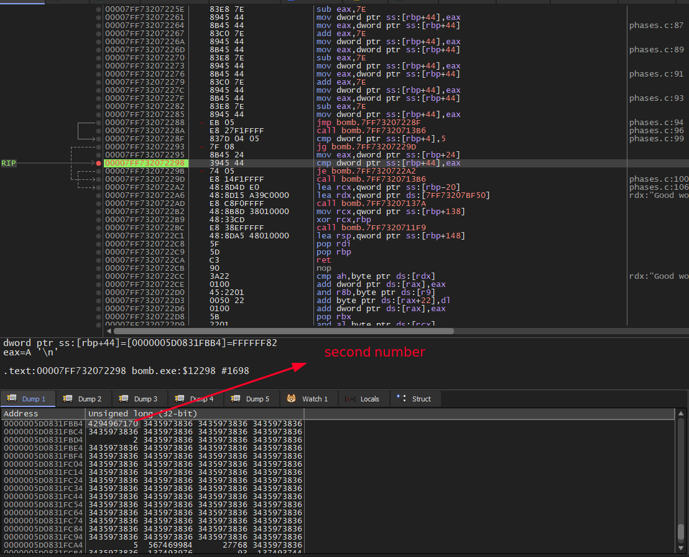

I think if we put another value in first element "any number equal or less than 5" it will do some math and return second number to be checked..
try "-334 22" for example, anything...

but, the program went to explode, this because the comparison uses **unsigned** values (`ja` instruction). Therefore, `-334` is interpreted as a very large unsigned integer (`0xFFFFFEB2`), making the comparison fail immediately.

using "3 12" for example
the second number must be  4294967170
same number as first time.

using first number 4
the second number must be 0

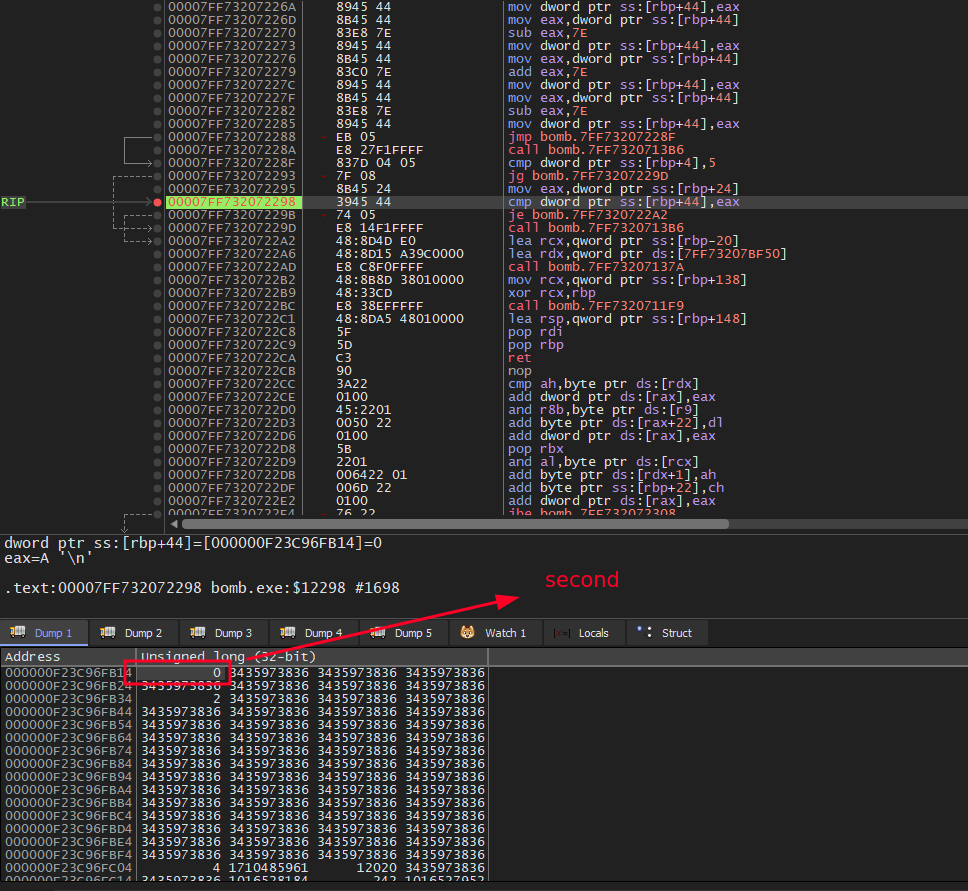
## phase_4

My notes while solving this phase

```txt
[rbp+4] = first		[0, 14]
[rbp+24] = second	= 10

func(first, 0, 14) == 10

---

[rbp+108] = arg2
[rbp+110] = arg3
[rbp+100] = arg1

[rbp+4] = cmp = ((arg3 - arg2) / 2) + arg2

if (cmp < arg1):
	return (cmp + func4(arg1, arg2, cmp-1))

if (cmp > arg1):
	return (cmp + func4(arg1, cmp+1, arg3))

if (cmp == arg1):
	return cmp


15 => 7 => 3 => 5

6 + 5 + 3 + 7 = 21 = 0x15
7 + 3 = 10 = 0xa
```

### First solution

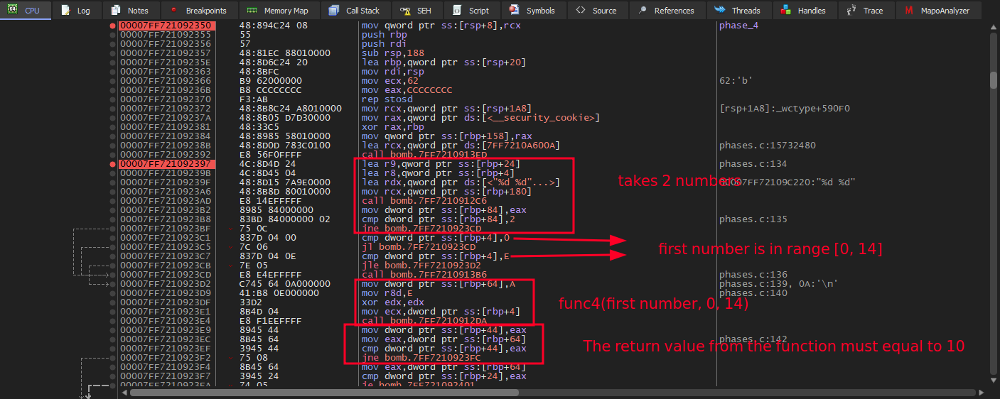

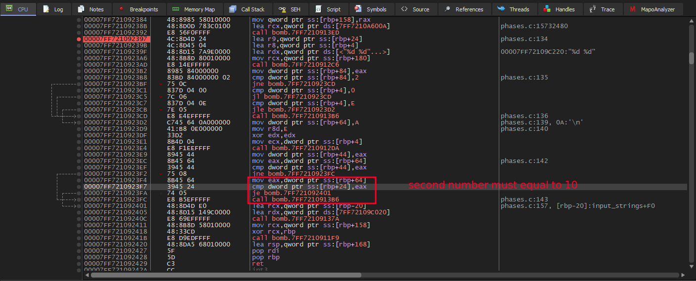

If we enter func4

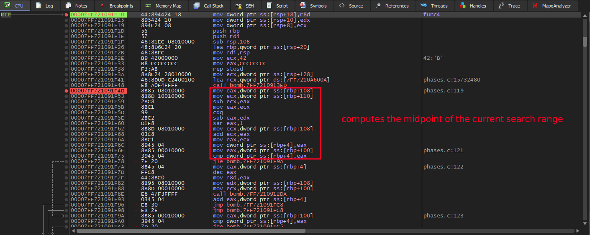

If the value of midpoint is equal to the first argument

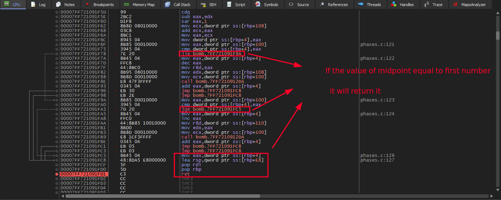

If the value of midpoint is less than the first argument

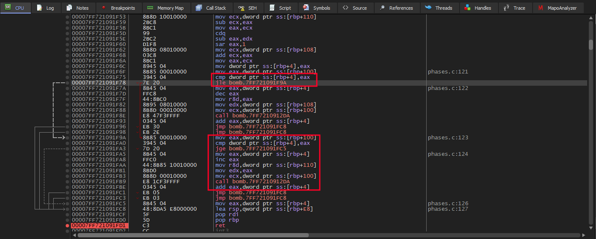

If the value of midpoint is more than the first argument

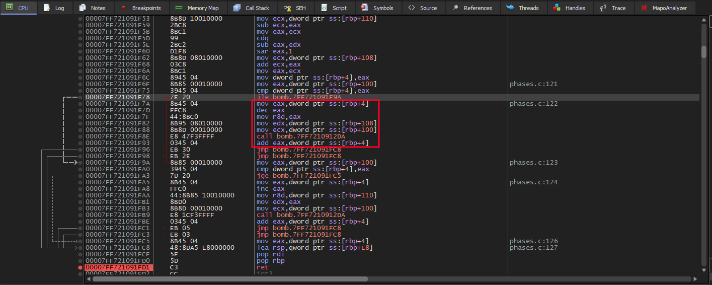

I entered "5 10" to trace the program and this is what I found:

When reached ret instruction the value in eax is same as the input

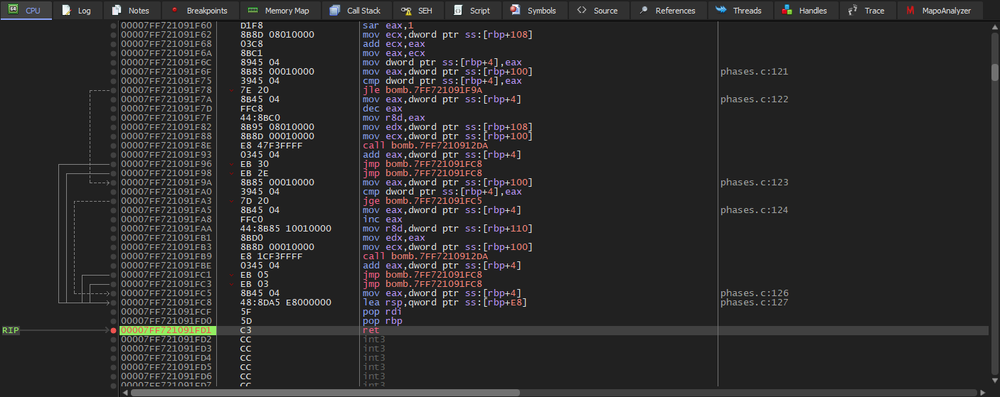

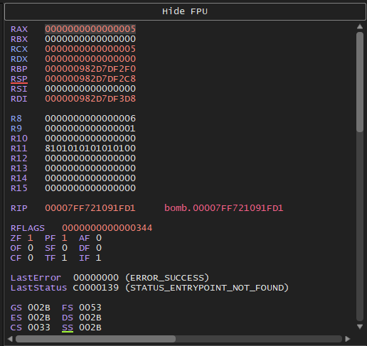

Then it returns to the previous ret address which pushed on the stack

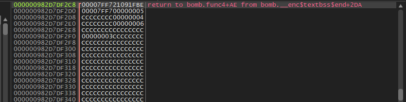

And adds to it the value of last midpoint

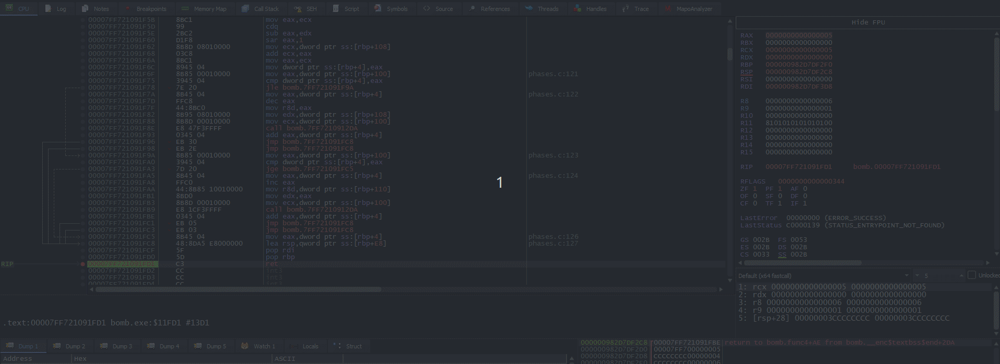

So, we entered 5 it added to it : 7+ 3, which is 15, 0xF

The function adds the sum of midpoints to your input.

The used equation in the code:

```c
cmp = ((arg3 - arg2) / 2) + arg2
which is equal to:
(arg3 + arg2) / 2
```

first midpoint = (0 + 14) / 2 = 7
second midpoint = (0 + 7) / 2 = 3
third midpoint = (3 + 7) / 2 = 5
now, we reached 5, so it returns 5 + 3 + 7 = 0xF

To get the value 10, we need to enter 3, 7 + 3 = 10

***
If you want to understand recursive functions more, 
check my article on [Recursive Functions in Assembly](data-structures/recursion-in-assembly.md){target="_blank"}.
***

### Another solution

I also traced the program and wrote this python burte force script:

```python
def phase_4():
	if (myInput > 0) and (myInput <= 14):
		x = func_4(myInput, 0, 14)
		if (x == 10):
			print(f"win , input = {myInput}")
		else:
			print(f"fail , input = {myInput}")


def func_4(myInput, num2, num3):
	cmp = num2 + ((num3 - num2) >> 1)	# 7

	if (cmp <= myInput):

		if (cmp >= myInput):
			return cmp

		return (cmp + func_4(myInput, cmp+1, num3))

	else:

		return (cmp + func_4(myInput, num2, cmp-1))

for i in range(14):
	myInput = i+1
	phase_4()

```

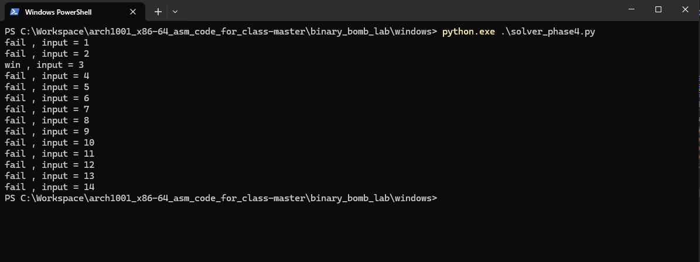

so, input is: 3 10

## phase_5

My notes while solving this phase:

```txt
[rbp+64] = first	<= 15
[rbp+84] = second

[rbp+44] = first

[rbp+4] = 0 = index
[rbp+24] = 0


if (first == 15):
	out

else:
	i+1
	first = arr[first]
	[rbp+24] = [rbp+24] + arr[first]


looping for 16 round
second = [rbp+24]

arr[16] = {10, 2, 14, 7, 8, 12, 15, 11, 0, 4, 1, 13, 3, 9, 6, 5}


15
6
14
2
1
10
0
8
4
9
13
11
7
3
12
5


5 115
```

### First solution

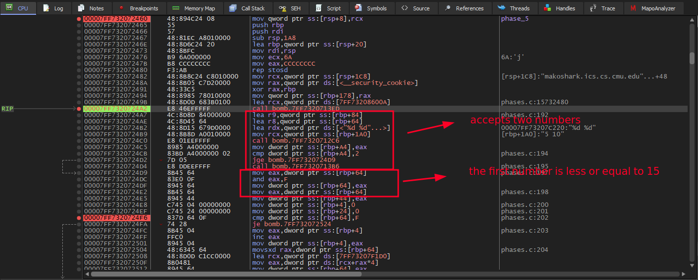

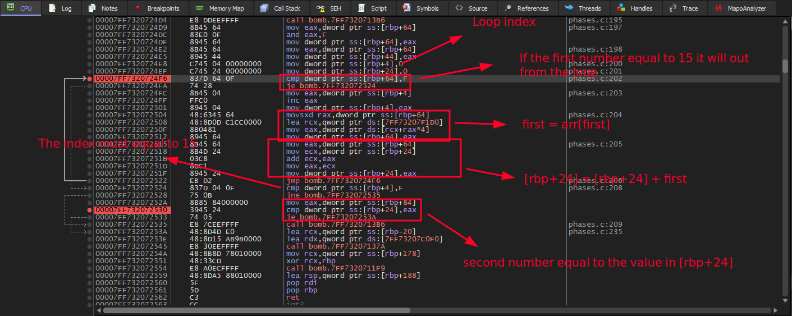

so, we need to loop for 15 time, and get 15 at last loop
we have the equation:
	first = arr[first]

At the address 00007FF73207F1D0 on the stack, the array found, if we converted the view to unsigned long:

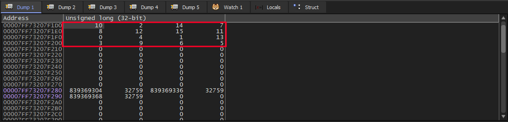

To loop for 15 time and the last loop contains 15, we need to start from the back:
15 
6
14
2
1
10
0
8
4
9
13
11
7
3
12
5

So the first number is: 5
We can put a breakpoint at the address 00007FF732072530 to get the value of the second number, which is stored in [rbp+24]
or you can add these inputs and calculating it by yourself, but don't add 5, because the value of [rbp+24] at the first is 0, and start to add from the second element, the answer will be 115

### Another solution
Here again I traced the program and wrote this python script

```python
arr = [10, 2, 14, 7, 8, 12, 15, 11, 0, 4, 1, 13, 3, 9, 6, 5]

for i in range(16):
	num1 = i
	n_44 = num1
	n_4 = 0
	n_24 = 0
	
	while (num1 != 15):
		n_4 += 1
		num1 = arr[num1]
		n_24 = n_24 + num1

	if (n_4 == 15):
		print(f"num1 = {i}")
		print(f"num2 = {n_24}")
	else:
		print("fail")

# After anding first num is in range 0 to 0xF

```

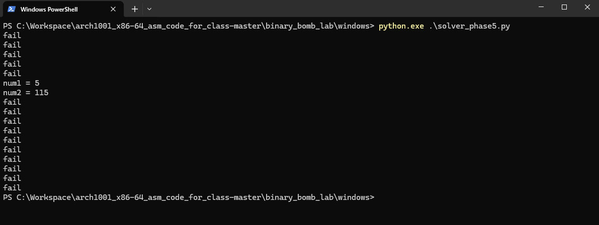

so, input is: 5 115

## phase_6

My notes while solving this phase:

```txt
node1{
	530,
	1,
	00007FF76F13F040
}

[rbp+8] = address of node1

[rbp+48 + rax*4] = my input

elements => [1, 6] and different in values

=====

[rbp+28] = address of node1

[rbp+78 + rax*8] = address of node1

[rbp+78 + rax*8] = address of node2

so array of address to linked list at address [rbp+78]

====

[rbp+rax+78] = [rbp+8] = [rbp+28] = array of nodes

[r]

[rbp+C4] = loop_index + 1

first address of node1 is 0

compares first element "dword" in previous node with current node

previous >= current
```

In this phase, the program accepts six numbers as input.

We can analyze this phase in 4 blocks

### Block 1

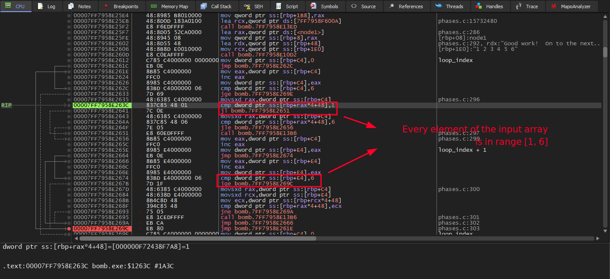

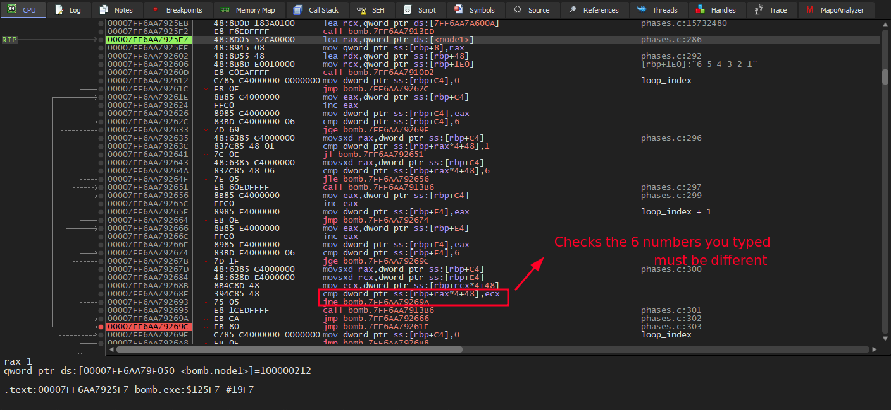

### Block 2

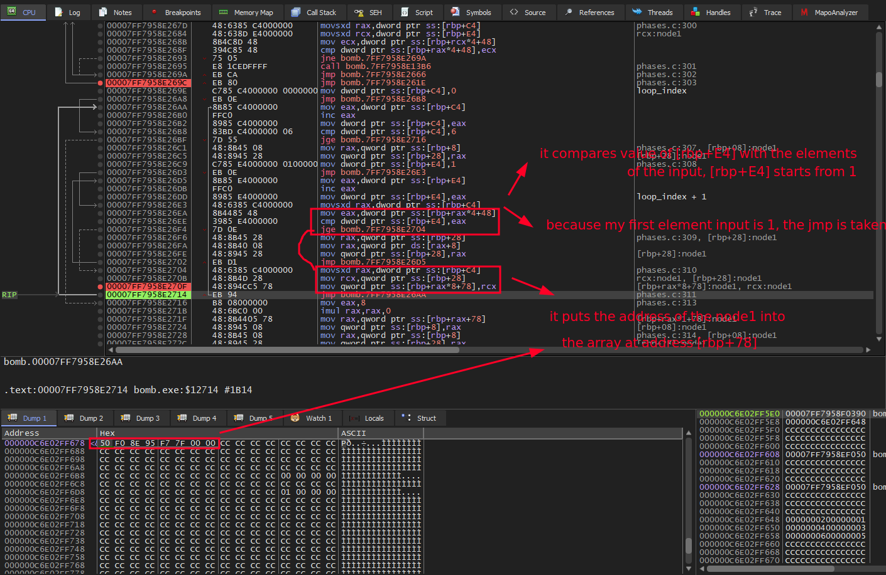

trying with the second input which is 2 in my case, to understand what this block do

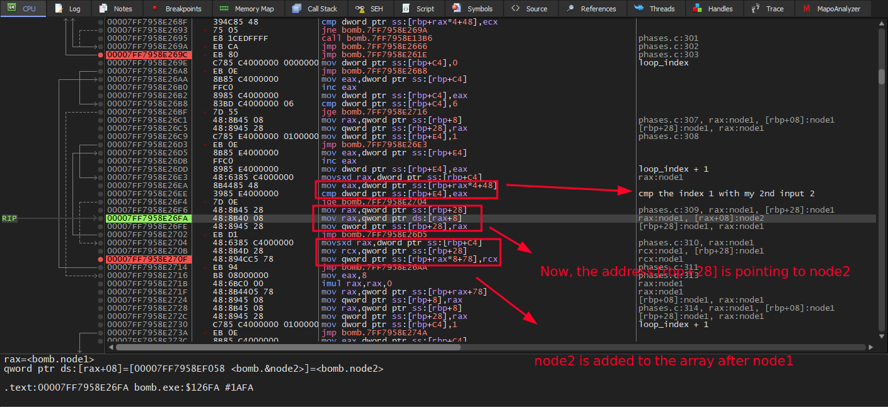

when trying with the other inputs which is 3 4 5 6 in my case, to understand what this block do more...
it added the address of node3 to the array

After this block finishes, the contents of the array at address [rbp+78] is: 
node1, node2, node3, node4, node5, node6

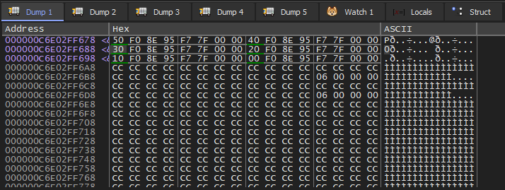

### Block 3

before looping:
[rbp+8] = [rbp+28] = [rbp+78] => the array of nodes

After tracing this block, [rcx+8]  and rax have the address of the next node from rcx
rcx have the address of current address

maybe the useful thing from this block is to see the value of [rbp+28] after this block finishes, because it used in the last block

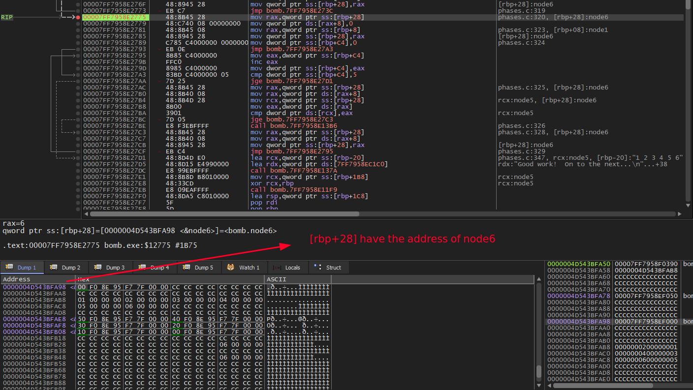

***
If you want to understand linked lists more, 
check my article on [Linked Lists in Assembly](data-structures/linked-lists-in-assembly.md){target="_blank"}.
***

### Block 4

before looping:
[rbp+8] is address of node1
and now [rbp+28] have the address of node1

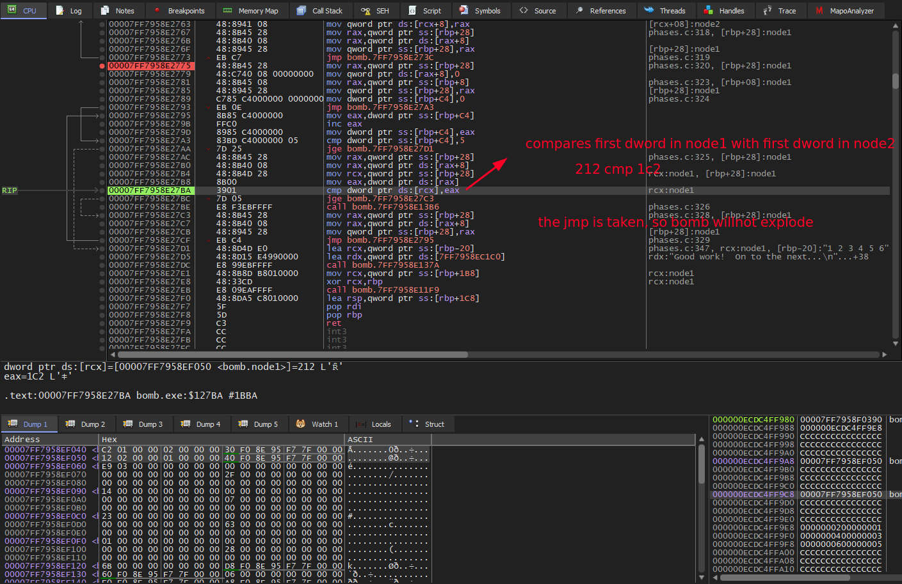

This block compares the first dword in current block with the next block, if it greater or equal the bomb will not explode.

Now, we know that the nodes are arranged in an array with the number we typed to the program.

So, we first need to know all the first dword value for all nodes.
then put them in a way that first dword for the typed input is greater or equal to the next.

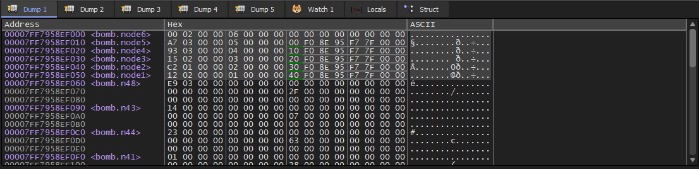

If we converted them to unsigned long (32-bit)

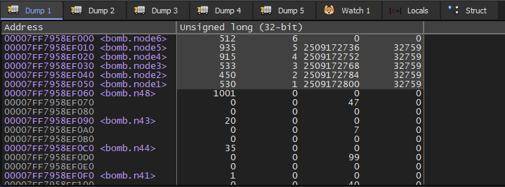

node5 > node4 > node3 > node1 > node6 > node2

so, our input is:
5 4 3 1 6 2
