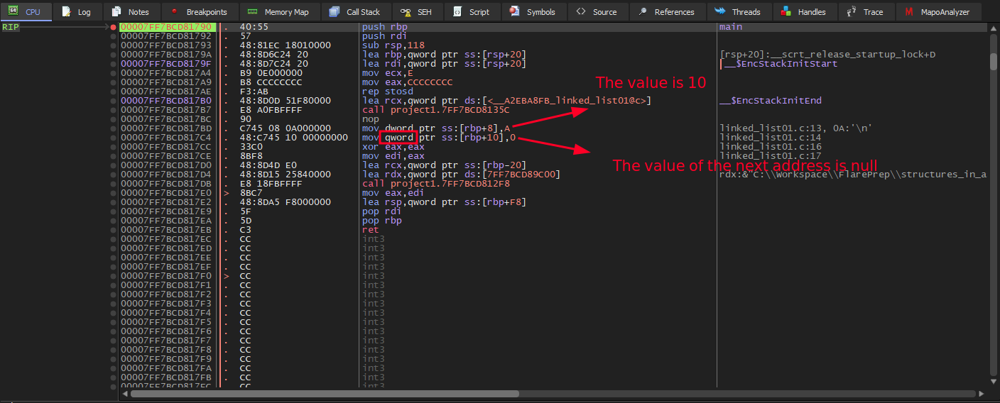
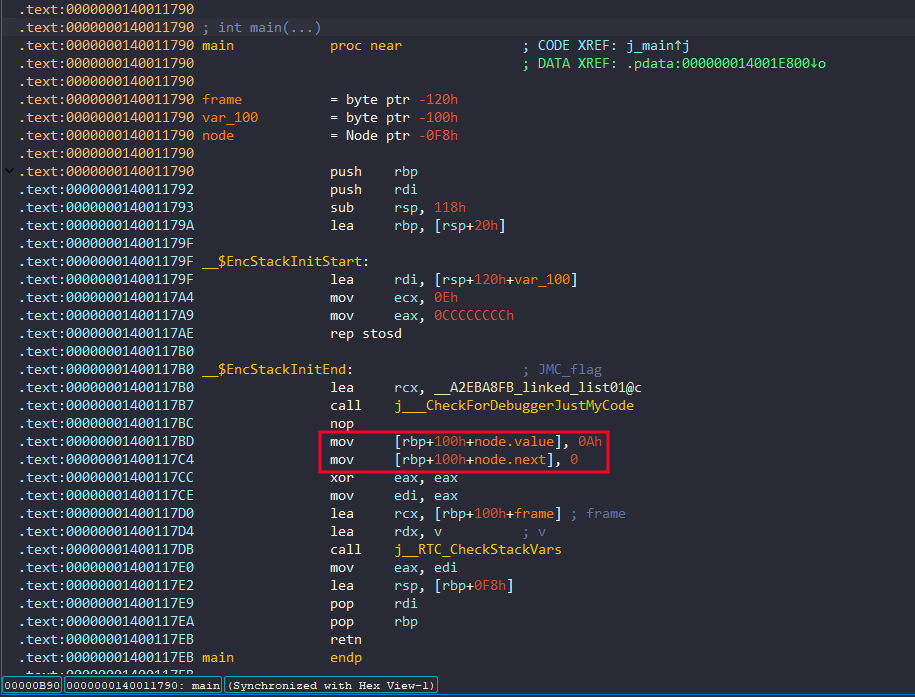
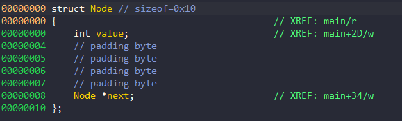
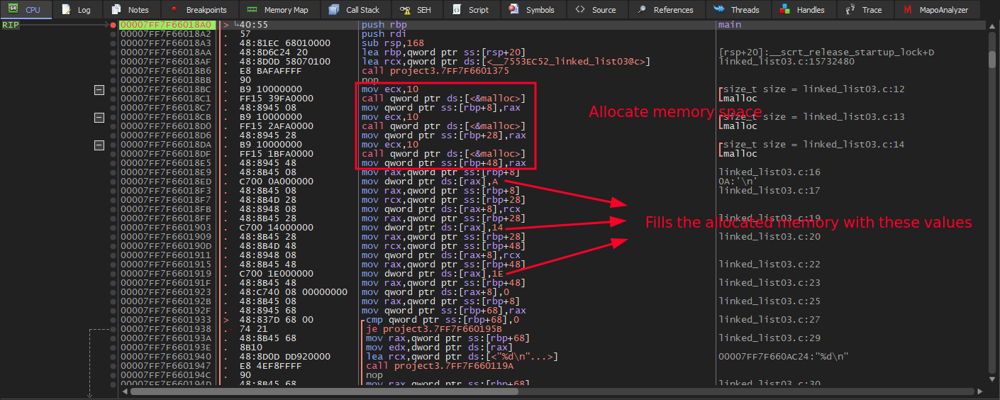
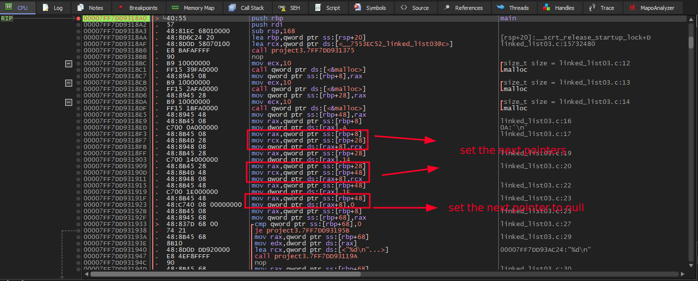
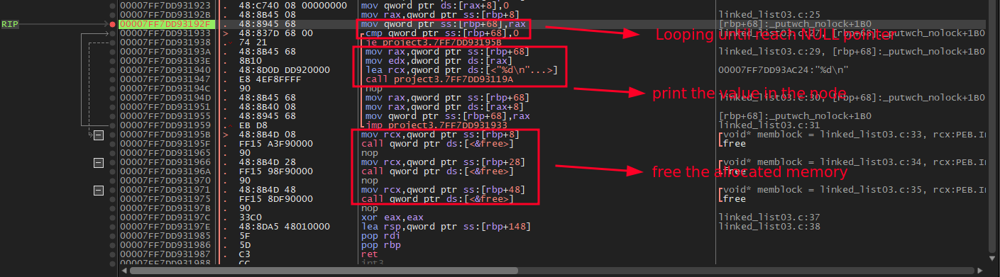

# Linked Lists in Assembly (x64dbg)

## Analyzing a Single Node

```c
#include <stdio.h>

typedef struct Node
{
    int value;
    struct Node *next;
} Node;

int main()
{
    Node node;

    node.value = 10;
    node.next = NULL;

    return 0;
}

```

The assembly does not clearly indicate that a structure is being used. The compiler simply writes values to memory, just as it would for ordinary local variables.

One small clue is that the second member begins at `[rbp+10h]` instead of `[rbp+0Ch]`. This is because the compiler inserted four bytes of padding after the `int` member so that the pointer is aligned on an 8-byte boundary.

However, this alone is **not enough** to conclude that the object is a linked list—or even a structure. From the assembly alone, we only know that there is a 4-byte value followed by an 8-byte value.

We can't identify a linked list from a single instruction or a single object. Instead, we recognize the overall pattern created by pointer dereferences, traversal loops, and `NULL` termination. We will see these patterns in the following examples.



When the program is compiled with debug information (PDB), ida can recover the structure definition and display the member names and offsets.




## Analyzing Multiple Nodes

```c

#include <stdio.h>
#include <stdlib.h>

typedef struct Node
{
    int value;
    struct Node *next;
} Node;

int main()
{
    Node *head = malloc(sizeof(Node));
    Node *second = malloc(sizeof(Node));
    Node *third = malloc(sizeof(Node));

    head->value = 10;
    head->next = second;

    second->value = 20;
    second->next = third;

    third->value = 30;
    third->next = NULL;

    Node *cur = head;

    while (cur)
    {
        printf("%d\n", cur->value);
        cur = cur->next;
    }

    free(head);
    free(second);
    free(third);

    return 0;
}

```








## Conclusion

You can recognize the linked lists, if the code meets:
- Accessing the first field (`[reg]`).
- Accessing the pointer field (`[reg+8]`).
- Repeated pointer dereference.
- A loop ending when the pointer becomes `NULL`.
