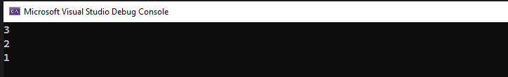
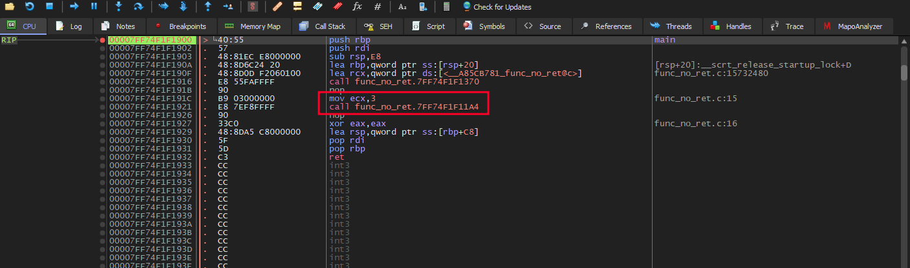
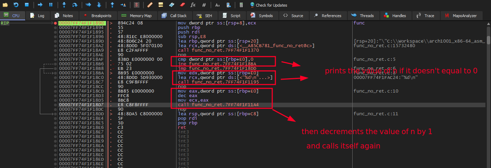
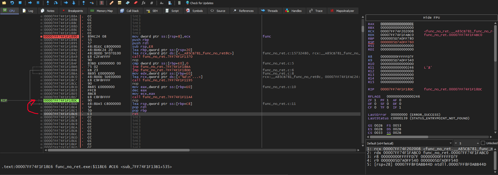
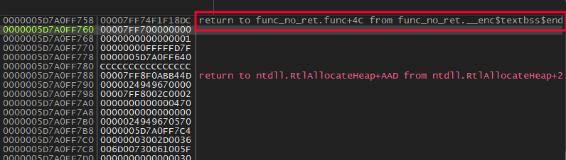
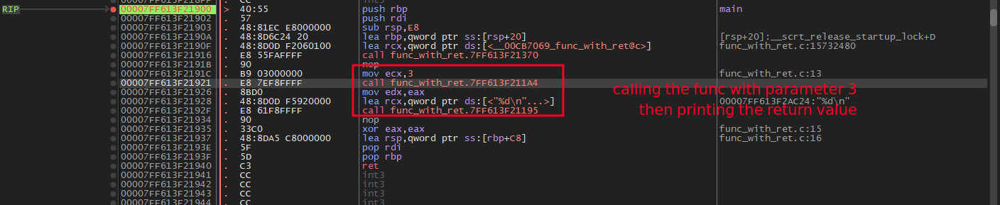
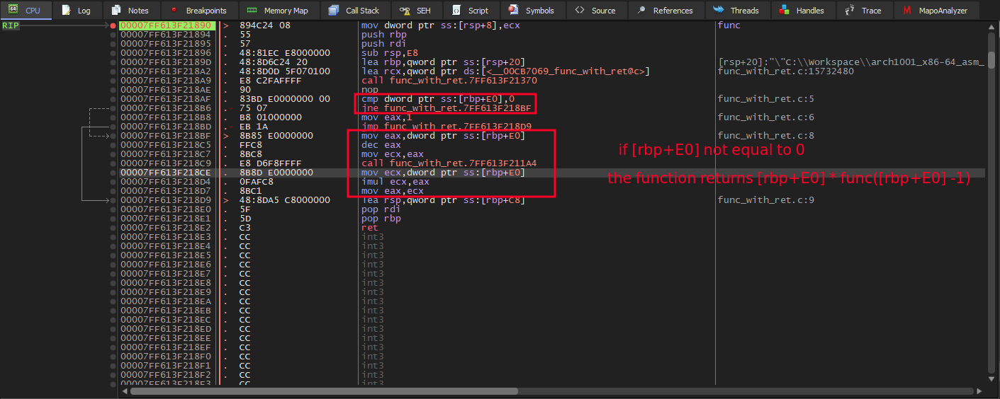
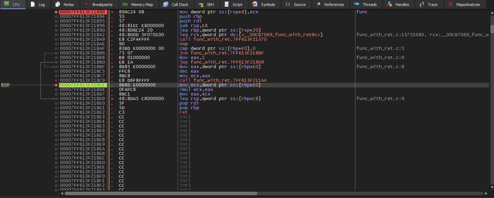
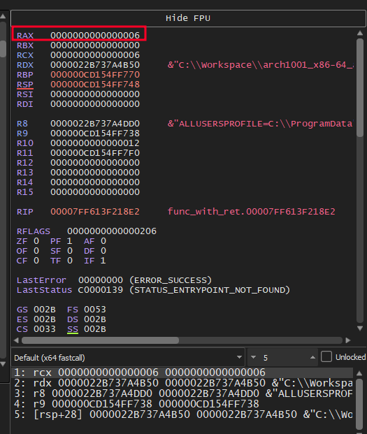

# Recursive Functions in Assembly (x64dbg)

I wrote two simple programs in c, compiled them, and traced their execution in x64dbg to understand how recursive functions works in assembly.
## Recursive Functions Without a Return Value (void)

```c
#include <stdio.h>

void func(int n)
{
    if (n == 0)
        return;

    printf("%d\n", n);

    func(n - 1);
}

int main()
{
    func(3);
}

```

The function prints the current value of n, decrements it by one, and recursively calls itself until n becomes zero. Since the function's return type is void, it does not return a value to its caller.




The main function calls the func and sends to it the value 3






after the call instruction, the caller does not use the value in eax. Although eax may contain a value left by previous instructions or function calls, the caller ignores it because a void function does not return a meaningful value.

When a function calls another function, the CPU pushes the return address onto the stack and creates a new stack frame for the callee.

The same behavior occurs when a function calls itself recursively. Every recursive call creates its own independent stack frame and stores its own return address on the stack.

Once the base case is reached, the recursive calls begin to return. Each ret instruction pops the corresponding return address from the stack and transfers execution back to the instruction immediately following the call instruction in the previous stack frame. This process continues until all recursive calls have returned.





## Recursive Functions With a Return Value

```c
#include <stdio.h>

int func(int n)
{
    if (n == 0)
        return 1;

    return n * func(n - 1);
}

int main()
{
    printf("%d\n", func(3));

    return 0;
}

```

The function recursively calls itself until it reaches the base case (n == 0), where it returns 1.






Once the base case is reached, the recursive calls stop. The program then begins stack unwinding. Each ret instruction returns execution to the instruction immediately following the corresponding call.

In this example, execution returns to address 0x00007FF613F218CE. At this point, the caller uses the return value from the previous recursive call to compute its own return value. This process repeats until all recursive calls have returned.



The return value of each recursive call is stored in rax. The caller then uses this value to perform the multiplication before returning to its caller.



